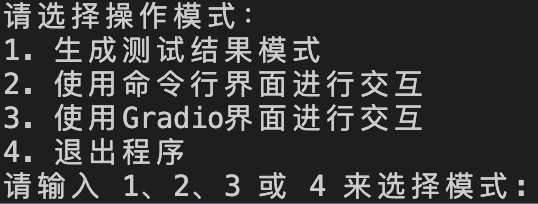
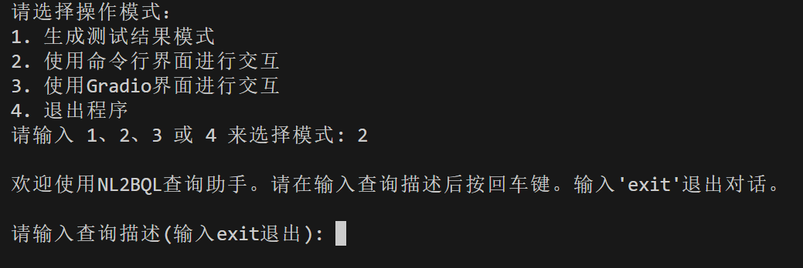
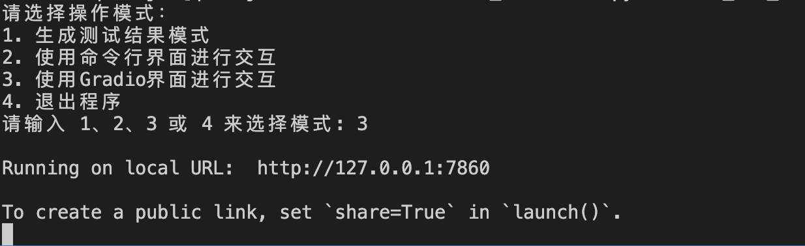
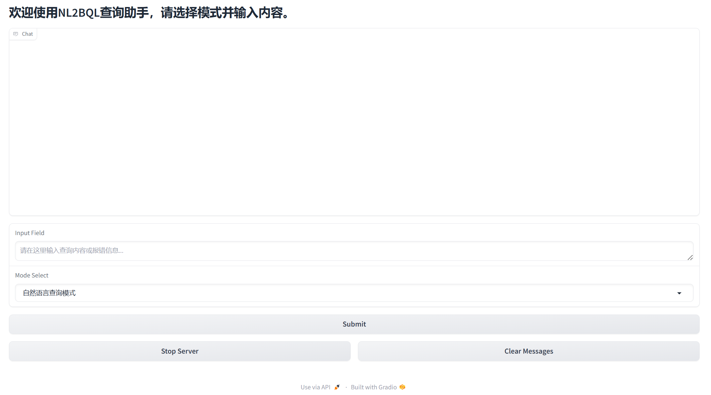

# 从容应队-说明文档

## 1.环境搭建

首先将仓库保存到本地解压缩后，进入仓库目录下

```bash
cd Final_Version
```

启动前准备环境：

```
conda create -n nb2bql python=3.10
```

```
conda activate nb2bql
```

然后下载运行代码必要的库：

```bash
pip install -r requirement.txt
```

运行代码（千问api需要在终端设置代理）

```
python one_for_all.py
```

## 2.使用方法

在运行之后会有三种模式以供选择：



* 第一种excel批量测试模式，在运行代码之前先在代码文件main函数中修改测试集路径，启动程序后，在命令行中输入数字1即可测试，结果保存在当前目录下的result.json文件及result_withNL.json文件中。其中，前者为比赛规定的结果格式，后者为方便查看和评判生成结果的格式。

* 第二种是命令行单条指令测试模式，启动程序后，在命令行中输入数字2，之后在提示符后输入测试指令等待片刻即可得到输出

  

* 第三种是可视化交互界面单条指令测试模式，启动程序后，在命令行中输入数字3，并根据给出的本地url访问，在输入框中输入测试指令即可在上面对话框中得到输出





## 3.模式介绍

### 1.自然语言查询模式

在该模式下，用户直接输入自然语言，若输入正确，系统会返回BQL语句；若输入有误，系统会返回相关报错。


### 2.生成语句改进模式&数据库响应异常处理模式

在该模式下，用户可以对系统生成的BQL提出优化建议，或将运行该BQL语句而产生的数据库响应异常的内容输入，系统将会根据用户的建议或错误提示重新生成BQL语句。


# 测试环节

## 单元测试

由于缺乏真实的数据库环境，我们对"NL2BQL测试验证集.xlsx"中的每个问题生成的 BQL 查询语句逐一进行逻辑检查，以确保输出基本符合预期。

### 测试结果解释和示例

#### `result.json` 的内容：

- **描述**: 包含 BQL语句 查询的生成结果，其中每个结果有唯一编号 (`Index`)、检索的 `BeID` 和生成的 BQL 语句。
- **示例数据**:

| Index | BeID                                                         | BQL                                                          |
| ----- | ------------------------------------------------------------ | ------------------------------------------------------------ |
| 1     | ["0029c056-484c-450f-8ce0-e85528ea7f51"]                     | SELECT SaleOrder.OrderCode, SaleOrder.TotalPrice, SaleOrder.PayMethod FROM SaleOrder.SaleOrder |
| 2     | ["07519aa2-4170-4949-9353-8e08709d21da", "e6cbbb12-3964-4bc8-90a2-8d07d3d99852"] | SELECT SaleOrder.OrderCode FROM SaleOrder.SaleOrder LEFT JOIN Customer.Customer ON SaleOrder.Customer = Customer.ID WHERE Customer.Credit_Code = 'A' |

#### `result_withNL.json` 的内容：

- **描述**: 包含原始自然语言查询、检索的BEID，原始的 BQL 语句及生成的 BQL 语句，INDEX以及BEID和BQL的匹配结果，具体的差异对比，方便同时进行对比查看。
- **说明**：可以直接在`result_withNL.json` 文件中，搜索关键字"不匹配"，查看有差异的例子
- **特别提示**："NL2BQL测试验证集.xlsx"中的一些问题的答案是错误的，例如下面的例子：

  ```python
      "查询折扣优惠大于0的销售订单的订单编号": {
          "BeID": [
              "0029c056-484c-450f-8ce0-e85528ea7f51"
          ],
          "BQL": "SELECT SaleOrder.OrderCode FROM SaleOrder.SaleOrder WHERE SaleOrder.TotalDiscounts > 0",
          "Index": "7",
          "Entities_Match": "完全匹配",
          "BQL_Match": "不匹配",
          "BQL_Difference": {
              "True_BQL": [
                  "SELECT SaleOrder.OrderCode from SaleOrder.SaleOrder where SaleOrder.Discount > 0"
              ],
              "Generated_BQL": [
                  "SELECT SaleOrder.OrderCode FROM SaleOrder.SaleOrder WHERE SaleOrder.TotalDiscounts > 0"
              ],
              "Optimized_BQL": [
                  "SELECT SaleOrder.OrderCode FROM SaleOrder.SaleOrder WHERE SaleOrder.TotalDiscounts > 0"
              ]
          }
      },
  ```

  其中，SaleOrder.TotalDiscounts字段才是正确的字段，在SaleOrder.OrderCode表中并没有SaleOrder.Discount字段，此时的True_BQL是错误的，因此我们需要对每一个不匹配的样例进行评判。
- **示例数据**:

| 自然语言查询                                   | BeID                                     | 生成的 BQL 语句                                              | Entities_Match | BQL_Match |                        BQL_Difference                        | Entities_Difference |
| :--------------------------------------------- | :--------------------------------------- | :----------------------------------------------------------- | :------------: | :-------: | :----------------------------------------------------------: | :-----------------: |
| 查询所有销售订单的订单编号、订单金额、支付方式 | ["0029c056-484c-450f-8ce0-e85528ea7f51"] | SELECT SaleOrder.OrderCode, SaleOrder.TotalPrice, SaleOrder.PayMethod FROM SaleOrder.SaleOrder |    完全匹配    | 完全匹配  |                              \                               |          \          |
| 查询折扣优惠大于0的销售订单的订单编号          | ["0029c056-484c-450f-8ce0-e85528ea7f51"] | SELECT COUNT(1) as OrderCount FROM SaleOrder.SaleOrder WHERE YEAR(SaleOrder.OrderTime) = '2024' |    完全匹配    |  不匹配   | "BQL_Difference": {"True_BQL":"...";"<br />Generated_BQL":"...";<br />"Optimized_BQL":"..."} |          \          |

同时，在单元测试中，我们加入了边界条件测试，包括空字符串输入、特殊字符等情况，以确保程序运行的鲁棒性。下面的表格为我们所做的单元测试。

| 自然语言       | 系统输出                                                     |
| -------------- | ------------------------------------------------------------ |
| ""             | 十分抱歉,您的查询请求未通过安全审查,原因: 请提供您需要审核的自然语言查询请求，以便我进行... |
| " "            | 十分抱歉,您的查询请求未通过安全审查,原因: 请提供您需要审核的自然语言查询请求，以便我进行... |
| "1"            | 十分抱歉,您的查询请求未通过安全审查,原因: 请提供您需要审核的自然语言查询请求，以便我进行... |
| "!"            | 十分抱歉,您的查询请求未通过安全审查,原因: 请提供您需要审核的自然语言查询请求，以便我进行... |
| "@"            | 十分抱歉,您的查询请求未通过安全审查,原因: 请提供您需要审核的自然语言查询请求，以便我进行... |
| ")"            | 十分抱歉,您的查询请求未通过安全审查,原因: 请提供您需要审核的自然语言查询请求，以便我进行... |
| "……"           | 十分抱歉,您的查询请求未通过安全审查,原因: 请提供您需要审核的自然语言查询请求，以便我进行... |
| "!!!!@@@@####" | 十分抱歉,您的查询请求未通过安全审查,原因: 请提供您需要审核的自然语言查询请求，以便我进行... |
| "a"            | 十分抱歉,您的查询请求未通过安全审查,原因: 非查询内容         |
| "aaa"          | 十分抱歉,您的查询请求未通过安全审查,原因: 非查询内容         |
| "I love you"   | 十分抱歉,您的查询请求未通过安全审查,原因: 非查询内容         |
| "ok"           | 十分抱歉,您的查询请求未通过安全审查,原因: 非查询内容         |
| "你好"         | 十分抱歉,您的查询请求未通过安全审查,原因: 非查询内容         |
| "你知道吗"     | 十分抱歉,您的查询请求未通过安全审查,原因: 非查询内容         |
| "盾壳vs蛋肯"   | 十分抱歉,您的查询请求未通过安全审查,原因: 非查询内容         |

------

## 集成测试

这部分涵盖了完整的流程测试，旨在验证从输入到输出的整个查询生成流程，确保各组件能够协同工作。

以下是集成测试的具体内容：

| 编号 | 用例名称         | 测试背景                             | 优先级 | 重要级 | 测试数据                                     | 测试步骤                                                     | 预期结果                         | 实际结果 |
| ---- | ---------------- | ------------------------------------ | ------ | ------ | -------------------------------------------- | ------------------------------------------------------------ | -------------------------------- | -------- |
| 1    | 测试大模型生成   | 无                                   | 1      | 1      | 内容：你是一个私人助手，可以回答我一些问题吗 | 运行 python 脚本，将 prompt 输入给指定 url 的大模型，等待其返回结果 | 大模型返回对测试数据的回答       | 正常回答 |
| 2    | 测试安全检查     | 大模型可以正常生成                   | 2      | 2      | 使用边界条件                                 | 将边界条件数据和安全检查 prompt 融合输入给大模型，得到检查结果 | 拒绝不合理查询，接受合理查询     | 正常回答 |
| 3    | 测试整体框架     | 基础部分正常                         | 2      | 2      | NaN                                          | 运行 python 主程序                                           | 正常运行                         | 正常运行 |
| 4    | 测试批量生成     | 整体框架可以正常运行，大模型生成正常 | 2      | 2      | 测试集文件                                   | 修改文件路径，运行主程序，输入 1，等待结果                   | 正常运行得到结果并保存到文件中   | 正常运行 |
| 5    | 测试命令行生成   | 整体框架可以正常运行，大模型生成正常 | 2      | 2      | 随机选择测试集中的数据                       | 运行主程序，输入 2，输入查询，等待结果                       | 正常运行得到结果并输出到终端窗口 | 正常运行 |
| 6    | 测试 gradio 方式 | 整体框架可以正常运行，大模型生成正常 | 2      | 2      | 随机选择测试集中的数据                       | 运行主程序，输入 3，打开本地浏览器，输入 url 和端口，输入查询，等待结果返回 | 正常运行得到结果并输出到网页窗口 | 正常运行 |
| 7    | 测试退出         | 框架正常运行                         | 3      | 3      | NaN                                          | 启动主程序，随机选择模式运行，运行过程中输入 4               | 进程退出，终端出现命令提示符     | 正常退出 |

------

## 系统测试

该部分内容与项目中的集成测试重合，故省略。

# **补充说明**

1. 若选择以Gradio界面进行交互，程序启动后请在浏览器中输入该地址进入NL2BQL系统交互界面：“http://127.0.0.1:7860”
2. 若想要更换测试集，请在”one_for_all.py”文件中的main()函数里进行更改对应的测试集路径，以及压缩实体文件路径（如果涉及到的数据库信息发生了改变）。
3. 若想更换为海岳大模型API，请在”one_for_all.py”文件的开头部分，修改client变量的api_key和base_url部分，以及修改model_name变量。
4. 由于通译千问模型的开源API托管在HuggingFace服务器上，因此在测试时需要有外网环境。测试过程中若控制台输出”网络错误”，此时网络存在波动，系统会自动重试，当连续重试失败次数达到阈值(10次)，则系统会终止测试，此时需要检查网络环境。